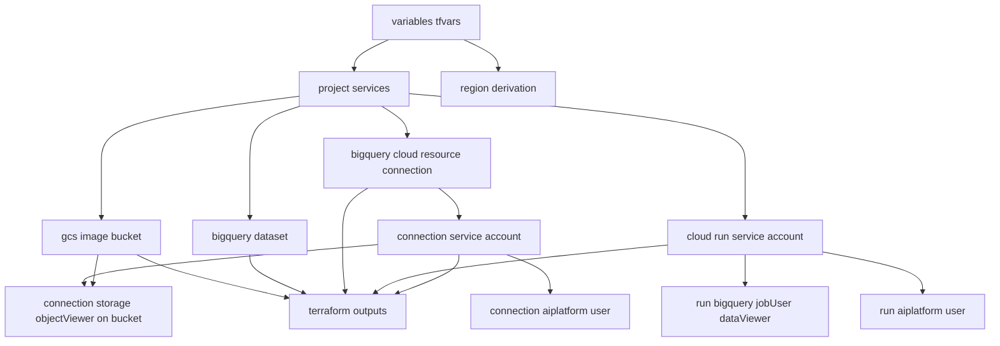
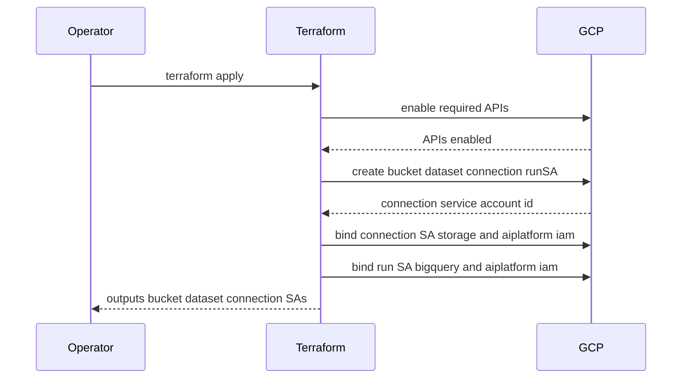

# Design Document

## Overview

本仕様は、テキスト→画像セマンティック検索システムが依存する GCP 基盤を Terraform で再現的・冪等に払い出す。`terraform apply` 一発で、必要 API 有効化・画像保管用 GCS バケット・BigQuery dataset・BigLake 用 BigQuery 接続（Cloud Resource connection）と接続サービスアカウントへの最小権限 IAM・Cloud Run 実行用サービスアカウントと最小権限 IAM・リモート state・リージョン整合の構成が構築される。

**Users**: インフラ管理者が本仕様で基盤を構築し、image-ingestion-pipeline と image-search-api が払い出されたリソース識別子を前提に独立実装する。

**Impact**: グリーンフィールド。Terraform 単一ルートモジュールを新規作成し、GCP プロジェクト上に基盤一式を構築する。

### Goals
- `terraform apply` のみで基盤一式を再現構築でき、再 apply に対して冪等であること。
- 接続・dataset・GCS・各サービスアカウント・IAM を払い出し、その識別子を出力として下流に公開すること。
- GCS / BigQuery / Vertex AI / Cloud Run のリージョン整合を単一設定から保証すること。
- 最小権限 IAM（接続 SA・Cloud Run SA）を構成すること。

### Non-Goals
- BigQuery リモートモデル（`gemini-embedding-2`）の SQL DDL 作成。
- Object Table・embeddings テーブル・`CREATE VECTOR INDEX` の作成。
- 検索 API のアプリケーション実装、Cloud Run サービス本体（コンテナイメージのデプロイ）。
- マルチ環境テンプレート化（子モジュール化）。現スコープは変数外部化で対応。

## Boundary Commitments

### This Spec Owns
- 必要 GCP API の有効化定義（BigQuery、BigQuery Connection、Vertex AI/aiplatform、Cloud Run、Cloud Storage、IAM）。
- 画像保管用 GCS バケット。
- BigQuery dataset。
- BigLake 用 BigQuery 接続（`cloud_resource`）と、接続 SA への GCS 読取・Vertex AI 利用の IAM。
- Cloud Run 実行用サービスアカウントと、その最小権限 IAM。
- Terraform ルートモジュール構成・入力変数・リモート state バックエンド・リージョン導出・出力。
- 払い出しリソース識別子の Terraform 出力（バケット名・dataset・接続 ID・接続 SA・Cloud Run SA）。

### Out of Boundary
- リモートモデル DDL、Object Table、embeddings テーブル、VECTOR INDEX（image-ingestion-pipeline 所有）。
- 検索クエリ・検索 API のアプリケーションコード、Cloud Run サービス本体のイメージデプロイ（image-search-api 所有）。

### Allowed Dependencies
- GCP プロジェクト（事前存在を前提）。
- Terraform 実行環境と、API 有効化・リソース作成・IAM 付与・state バケットアクセスに足る実行権限。
- Terraform Google / Google-beta provider。
- 上流以外への依存禁止: 下流（取込・検索）の振る舞いや命名規約を上流リソースに埋め込まない。

### Revalidation Triggers
- 出力名・出力構造（バケット名・dataset・接続 ID・SA メール等）の変更 → 下流両仕様の再確認が必要。
- 接続 SA / Cloud Run SA に付与するロールの増減 → 取込/検索の権限前提が変わるため再確認。
- リージョン設定の変更 → モデル提供リージョン整合の再確認。
- データ所有境界の変更（例: 本仕様で dataset 内テーブルを作り始める）→ 境界破壊として再設計。

## Architecture

### Architecture Pattern & Boundary Map

単一ルートモジュールを機能別 `.tf` に分割する。依存方向は「API 有効化 → 基盤リソース（GCS / dataset / 接続 / SA）→ IAM バインド → 出力」。IAM は接続 SA とバケット/プロジェクトに依存するため最後段に置く。



**Architecture Integration**:
- Selected pattern: 単一ルートモジュール + 機能別ファイル分割（KISS/YAGNI、`apply` 一発・レビュー容易）。
- Domain/feature boundaries: API・ストレージ・DWH・接続・実行基盤 SA・IAM をファイル単位で分離し、責務の重なりを排除。
- New components rationale: 各リソースは brief の Boundary Candidates に 1:1 対応。
- Steering compliance: roadmap の「全 Terraform 管理」「リージョン整合」「リモートモデル DDL は別管理」を遵守。

### Technology Stack

| Layer | Choice / Version | Role in Feature | Notes |
|-------|------------------|-----------------|-------|
| Infrastructure / Runtime | Terraform (>= 1.5) | IaC 実行エンジン | 単一ルートモジュール |
| Infrastructure / Runtime | google provider (>= 5.x) | GCP リソース管理 | API/GCS/dataset/SA/IAM |
| Infrastructure / Runtime | google-beta provider (>= 5.x) | beta 機能補完 | 接続等で必要時のみ |
| Data / Storage | Cloud Storage | 画像保管バケット | 単一リージョン |
| Data / Storage | BigQuery dataset / connection | DWH + BigLake 接続 | `cloud_resource` 接続 |
| Infrastructure / Runtime | GCS backend | Terraform リモート state | state 共有・ロック |

## File Structure Plan

### Directory Structure
```
terraform/
├── versions.tf        # terraform/provider バージョン制約と required_providers
├── backend.tf         # GCS リモートバックエンド設定
├── providers.tf       # google / google-beta provider 設定（project, region）
├── variables.tf       # 入力変数（project_id, region, naming prefix 等）とバリデーション
├── apis.tf            # google_project_service による必要 API 有効化
├── storage.tf         # google_storage_bucket（画像保管）と公開アクセス抑止設定
├── bigquery.tf        # google_bigquery_dataset
├── connection.tf      # google_bigquery_connection（cloud_resource）
├── iam.tf             # 接続 SA への storage/aiplatform IAM、Cloud Run SA への bigquery/aiplatform IAM
├── cloud_run_sa.tf    # google_service_account（Cloud Run 実行用）
├── outputs.tf         # 払い出しリソース識別子の出力
└── terraform.tfvars.example  # 変数入力例（必須値の雛形）
```

> `iam.tf` は接続 SA（connection.tf）と Cloud Run SA（cloud_run_sa.tf）の双方を消費する統合点。SA 定義と IAM バインドをファイルで分離し、依存方向を SA → IAM に固定する。

### Modified Files
- なし（グリーンフィールド。全ファイル新規作成）。

## System Flows

`terraform apply` の適用順序（暗黙的依存 + `depends_on`）:



API 有効化はリソース作成より先に完了させる（`depends_on`）。接続 SA への IAM は接続作成後に SA 識別子を参照して付与する。

## Requirements Traceability

| Requirement | Summary | Components | Interfaces | Flows |
|-------------|---------|------------|------------|-------|
| 1.1-1.4 | 必要 API の冪等な有効化 | ApiEnablement | apis.tf | apply seq |
| 2.1-2.5 | 画像保管 GCS バケット、最小権限、出力 | ImageBucket | storage.tf, outputs.tf | apply seq |
| 3.1-3.4 | BigQuery dataset、リージョン整合、出力 | BigQueryDataset | bigquery.tf, outputs.tf | apply seq |
| 4.1-4.7 | BigLake 接続と接続 SA への IAM、DDL 非作成 | BigLakeConnection, ConnectionIam | connection.tf, iam.tf, outputs.tf | apply seq |
| 5.1-5.5 | Cloud Run 実行 SA と最小権限 IAM、サービス本体非作成 | CloudRunServiceAccount, CloudRunIam | cloud_run_sa.tf, iam.tf, outputs.tf | apply seq |
| 6.1-6.7 | 構成・変数・state・リージョン導出・冪等・出力 | RootModuleConfig, OutputsContract | versions.tf, backend.tf, providers.tf, variables.tf, outputs.tf | apply seq |

## Components and Interfaces

| Component | Domain/Layer | Intent | Req Coverage | Key Dependencies (P0/P1) | Contracts |
|-----------|--------------|--------|--------------|--------------------------|-----------|
| RootModuleConfig | IaC config | 変数・provider・state・バージョン制約 | 6.1, 6.2, 6.3, 6.5, 6.6 | google provider (P0), GCS backend (P0) | State |
| ApiEnablement | IaC | 必要 API の有効化 | 1.1, 1.2, 1.3, 1.4 | project (P0) | Batch |
| ImageBucket | Storage | 画像保管バケット | 2.1, 2.2, 2.4, 2.5 | ApiEnablement (P0), region (P0) | State |
| BigQueryDataset | DWH | dataset 払い出し | 3.1, 3.2, 3.4 | ApiEnablement (P0), region (P0) | State |
| BigLakeConnection | DWH | Cloud Resource 接続払い出し | 4.1, 4.2, 4.3, 4.6, 4.7 | ApiEnablement (P0), region (P0) | State |
| ConnectionIam | IAM | 接続 SA への GCS/Vertex 権限 | 4.4, 4.5 | BigLakeConnection (P0), ImageBucket (P0) | State |
| CloudRunServiceAccount | Runtime | Cloud Run 実行 SA | 5.1, 5.5 | ApiEnablement (P0) | State |
| CloudRunIam | IAM | Run SA への BigQuery/Vertex 権限 | 5.2, 5.3 | CloudRunServiceAccount (P0) | State |
| OutputsContract | IaC | 払い出し識別子の出力 | 2.3, 3.3, 4.3, 5.4, 6.7 | 全リソース (P0) | State |

### IaC Config

#### RootModuleConfig

| Field | Detail |
|-------|--------|
| Intent | provider・state・変数・バージョン制約と、単一 `region` からのロケーション導出 |
| Requirements | 6.1, 6.2, 6.3, 6.5, 6.6 |

**Responsibilities & Constraints**
- `project_id`・`region`・命名プレフィックス等を入力変数として外部化し、必須値はバリデーションで強制する（6.2, 6.6）。
- state を GCS リモートバックエンドで管理し、複数実行者で共有・ロックする（6.3）。
- 全リソースのロケーションを単一 `region` 変数から導出してリージョン整合を保証する（6.4）。
- すべて Terraform 管理とし、手動操作前提を持たない（6.1）。

**Dependencies**
- External: google/google-beta provider — リソース管理（P0）
- External: GCS backend バケット — state 保存（P0、事前存在を前提とし**部分設定で指定**）

**Contracts**: State [x]

##### State Management
- State model: GCS backend（バケット + prefix）。
- Persistence & consistency: リモート state + ロックで実行者間整合。
- Concurrency strategy: backend ロックにより同時 apply を直列化。
- **Backend 設定の制約（重要）**: `backend "gcs"` ブロックは Terraform 言語仕様上 `var.*` を参照できない。したがって state bucket は `var.state_bucket` で渡さず、以下のいずれかで指定する:
  - 部分設定: `backend.tf` には `backend "gcs" {}` のみ記述し、`terraform init -backend-config=backend.hcl`（または `-backend-config="bucket=..."`）で bucket/prefix を注入する。`backend.hcl.example` を雛形として同梱する。
  - もしくは backend.tf に固定値で直接記述する（環境ごとに値が変わらない場合）。
- **State bucket のブートストラップ**: state 用 GCS バケット自体は本ルートモジュールの管理対象外（chicken-and-egg 回避のため）。手動作成、または別の最小 Terraform 構成で事前払い出しする手順を runbook に明記する。

**Implementation Notes**
- Integration: `region` 変数を ImageBucket/BigQueryDataset/BigLakeConnection に伝播。
- Validation: 必須変数（project_id, region）に `validation` ブロックを設定（state bucket は backend 部分設定で扱うため変数バリデーション対象外）。
- **リージョン整合の強制（重要 / 6.4 の中核）**: 本システムは下流の `AI.GENERATE_EMBEDDING`（BigLake 接続 + リモートモデル + dataset の co-location 前提）に依存するため、BigQuery dataset/接続のロケーションと `gemini-embedding-2`（Vertex）提供リージョンの不一致は取込・検索を破綻させる。これを文書化のみに留めず、`region` 変数に `validation` ブロックを設け、`gemini-embedding-2` がサポートするリージョンの許可リストに制約する。
  - 許可リストの具体値は最新のモデル提供リージョンを確認して設定する（実装時に確定）。
  - BigQuery を multi-region（US/EU）で使う選択肢は、Vertex の single-region との co-location 要件と矛盾しうるため、本仕様では single-region 前提で統一する。
- Risks: 許可リスト未更新によりモデル提供リージョン変更に追従できないリスク → リージョン変更を Revalidation Trigger 済みとして扱い、許可リストの保守を運用に明記。

### IaC / Storage / DWH / Runtime

#### ApiEnablement / ImageBucket / BigQueryDataset / BigLakeConnection / CloudRunServiceAccount

これらは新たな対外契約を持たず、GCP リソースを宣言的に作成する State 系コンポーネント。要点のみ記す。

- **ApiEnablement**: `google_project_service` で BigQuery / BigQuery Connection / Vertex AI(aiplatform) / Cloud Run / Cloud Storage / IAM を有効化。後続リソースは `depends_on` で API 有効化後に作成（1.1-1.4）。冪等性は provider が保証。**既定方針として `disable_on_destroy = false` を設定する**（`terraform destroy` 時に API を無効化せず、共有プロジェクト上の他システムへの副作用を防ぐ。1.4 の冪等性とも整合）。
- **ImageBucket**: `google_storage_bucket`。location は `region` 由来。`public_access_prevention = enforced`、`uniform_bucket_level_access = true` で公開アクセスを抑止（2.4）。`prevent_destroy` 相当の安全運用で既存破壊を避ける（2.5）。
- **BigQueryDataset**: `google_bigquery_dataset`。location は `region` 由来（3.2）。既存テーブルを破壊しない（3.4）。
- **BigLakeConnection**: `google_bigquery_connection` に `cloud_resource {}`。location は `region` 由来（4.2）。接続 SA は属性参照で取得（4.3）。本仕様はリモートモデル DDL を作らない（4.6）。

**Contracts**: State [x] / Batch [x]（ApiEnablement の API セットを Batch 的構成として扱う）

##### Batch / Job Contract（ApiEnablement）
- Trigger: `terraform apply`。
- Input / validation: 有効化対象 API のリスト（コード定義、1.2）。
- Output / destination: GCP プロジェクトの API 有効化状態。
- Idempotency & recovery: 既有効化 API でも冪等。伝播遅延時は再 apply で回復（1.4）。

### IAM

#### ConnectionIam / CloudRunIam

| Field | Detail |
|-------|--------|
| Intent | 接続 SA と Cloud Run SA に最小権限ロールをバインドする統合点 |
| Requirements | 4.4, 4.5, 5.2, 5.3 |

**Responsibilities & Constraints**
- ConnectionIam: 接続 SA に対し、画像バケットへ `roles/storage.objectViewer`（バケットスコープ、4.4）、プロジェクトへ `roles/aiplatform.user`（4.5）。
- CloudRunIam: Cloud Run SA に対し、`roles/bigquery.jobUser` と dataset/プロジェクトへの読取（`roles/bigquery.dataViewer` 相当、5.2）、`roles/aiplatform.user`（5.3）。
- 最小権限を保ち、公開や過剰権限を付与しない。

**Dependencies**
- Inbound: BigLakeConnection — 接続 SA 識別子（P0）
- Inbound: ImageBucket — バケットスコープ IAM 対象（P0）
- Inbound: CloudRunServiceAccount — Run SA 識別子（P0）

**Contracts**: State [x]

##### State Management
- State model: `google_storage_bucket_iam_member` / `google_project_iam_member` / `google_bigquery_dataset_iam_member` のメンバーバインド。
- Persistence & consistency: メンバー単位バインドで他メンバーを上書きしない（authoritative ではない member リソースを使用）。
- Concurrency strategy: 属性参照により SA 作成後に評価。

**Implementation Notes**
- Integration: SA メールを参照しメンバー文字列を構成。
- Validation: 付与ロールがコード上で明示され、増減は Revalidation Trigger。
- Risks: Vertex 権限がプロジェクトスコープになる点を許容（リソーススコープ IAM の細分化困難のため）。

### IaC Output

#### OutputsContract

| Field | Detail |
|-------|--------|
| Intent | 下流が参照する払い出し識別子を一括出力 |
| Requirements | 2.3, 3.3, 4.3, 5.4, 6.7 |

**Responsibilities & Constraints**
- 出力: 画像バケット名、dataset（project 修飾識別子）、接続 ID（project.location.connection）、接続 SA、Cloud Run SA メール。
- 出力名は安定契約であり、変更は Revalidation Trigger。

**Contracts**: State [x]

**Implementation Notes**
- Integration: image-ingestion-pipeline と image-search-api が `terraform output` で参照する前提。
- Validation: 各出力が非空であることを apply 後に確認可能。

## Data Models

本仕様はアプリケーションデータモデルを持たない。管理対象は GCP リソースの構成情報のみ。

### Logical Data Model（リソース識別子契約）
- ImageBucket: グローバル一意なバケット名（命名プレフィックス + 用途）。
- BigQueryDataset: `project_id.dataset_id`。
- BigLakeConnection: `projects/{project}/locations/{region}/connections/{connection_id}` と接続 SA。
- CloudRunServiceAccount: `name@project.iam.gserviceaccount.com`。
- 参照整合性: IAM バインドは上記 SA 識別子を参照（外部キー相当）。

## Error Handling

### Error Strategy
- 宣言的 IaC のため、エラーは `terraform plan/apply` 時に検出する。

### Error Categories and Responses
- **入力エラー**: 必須変数欠落 → `validation` ブロックで apply 前に失敗し欠落値を明示（6.6）。
- **依存/伝播エラー**: API 未有効化によるリソース作成失敗 → `depends_on` で順序保証、伝播遅延は再 apply で回復（1.3, 1.4）。
- **権限エラー**: 実行アカウントの権限不足 → provider エラーを運用者に提示（前提条件として Allowed Dependencies に記載）。

### Monitoring
- `terraform plan` の差分と `terraform output` を運用上の検証ポイントとする。

## Testing Strategy

### 検証項目（受入基準由来）
- **構成検証（plan/validate）**:
  - `terraform validate` が成功すること（6.1）。
  - 必須変数を欠いた入力で `plan` がバリデーション失敗すること（6.6）。
  - 全リソースのロケーションが単一 `region` から導出され一致すること（6.4, 2.2, 3.2, 4.2）。
- **適用・冪等検証（apply）**:
  - 初回 `apply` で API・バケット・dataset・接続・両 SA・IAM・出力が作成されること（1.1, 2.1, 3.1, 4.1, 5.1, 6.7）。
  - 連続 `apply` が冪等で差分ゼロになること（1.4, 2.5, 3.4, 4.7, 6.5）。
- **IAM/権限検証**:
  - 接続 SA がバケット読取と aiplatform user を持つこと（4.4, 4.5）。
  - Cloud Run SA が bigquery 実行/読取と aiplatform user を持つこと（5.2, 5.3）。
  - バケットが公開アクセス不可であること（2.4）。
- **境界検証**:
  - リモートモデル DDL・Object Table・Cloud Run サービス本体が本構成に含まれないこと（4.6, 5.5）。
  - 出力が下流参照に必要な識別子（バケット名・dataset・接続 ID・接続 SA・Run SA）を含むこと（2.3, 3.3, 4.3, 5.4, 6.7）。

## Security Considerations
- 公開アクセス抑止（`public_access_prevention=enforced`、`uniform_bucket_level_access=true`）でバケットの誤公開を防止（2.4）。
- 最小権限 IAM: 接続 SA はバケットスコープの objectViewer + aiplatform user、Cloud Run SA は bigquery 実行/読取 + aiplatform user に限定。
- state は機密（リソース識別子・構成）を含むためリモートバックエンドのアクセス制御に依存（前提）。

## Performance & Scalability
- 本仕様は基盤払い出しのみで実行時性能要件を持たない。リージョン整合は検索精度・実行可能性の前提として担保する（6.4）。
