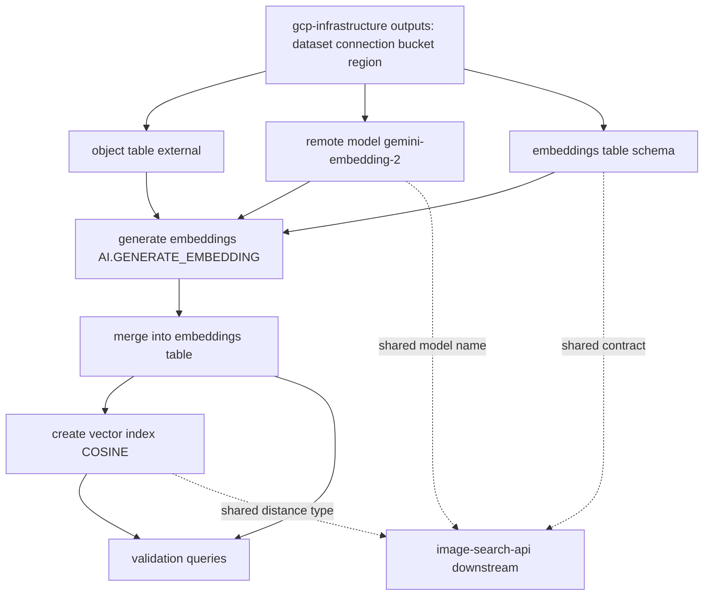
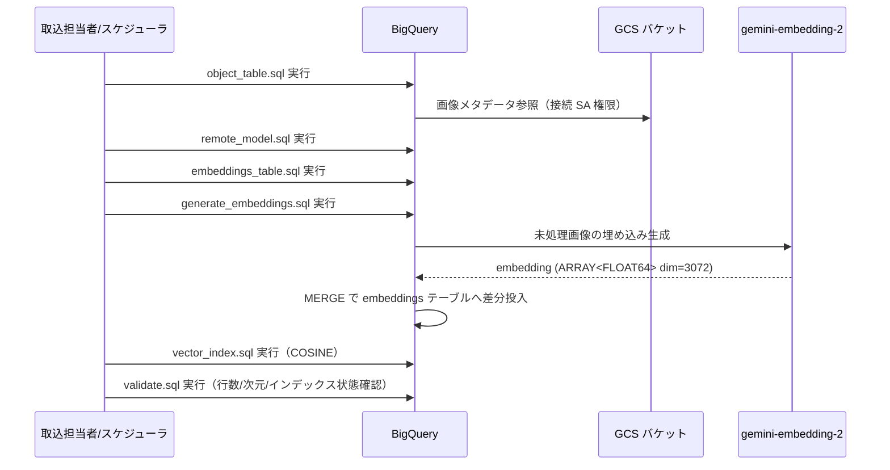

# Design Document

## Overview

`image-ingestion-pipeline` は、画像セマンティック検索システムの取込層を BigQuery ネイティブ・純 SQL で構築する。`gcp-infrastructure` が払い出した GCS バケット・BigQuery dataset・BigLake 接続（`cloud_resource`）・IAM を消費し、次の SQL 資産群を所有・実行する。

1. Object Table（GCS 画像の論理ビュー、BigLake 接続経由）
2. リモートモデル（`gemini-embedding-2` 参照、Terraform 管理外の SQL DDL）
3. embeddings テーブル（画像 URI/メタ + 埋め込みベクトル、下流共有契約）
4. 埋め込み生成バッチ（`AI.GENERATE_EMBEDDING` による差分取込）
5. VECTOR INDEX（距離タイプ `COSINE`）

常駐サービスは持たず、SQL スクリプト/スケジュールドクエリで運用する。本設計は「embeddings テーブルスキーマ・埋め込み次元・モデル名・距離タイプ」を下流 `image-search-api` への唯一の共有契約 source of truth として確定する。

### Goals
- GCS 画像から再現可能な SQL 群で埋め込みテーブルと VECTOR INDEX を生成・再生成できる。
- 取込と検索が同一モデル（`gemini-embedding-2`）・同一次元・同一距離タイプで連携できる共有契約を確定する。
- 全 SQL を冪等に扱い、画像追加時の差分取込を安全に運用できる。

### Non-Goals
- GCS バケット・dataset・BigLake 接続・IAM・API 有効化の作成（`gcp-infrastructure` 所有）。
- 検索クエリ実行・テキスト→画像検索 API・Cloud Run サービス本体（`image-search-api` 所有）。
- イベント駆動の自動取込、画像→画像検索、マルチ環境テンプレート化。

## Boundary Commitments

### This Spec Owns
- `sql/object_table.sql`: Object Table の `CREATE OR REPLACE EXTERNAL TABLE`（BigLake 接続経由、`object_metadata='SIMPLE'`）。
- `sql/remote_model.sql`: リモートモデルの `CREATE OR REPLACE MODEL ... REMOTE WITH CONNECTION OPTIONS(ENDPOINT='gemini-embedding-2')`（Terraform 外）。
- `sql/embeddings_table.sql`: embeddings テーブルの `CREATE TABLE IF NOT EXISTS`（列名・次元 3072・距離タイプは共有契約）。
- `sql/generate_embeddings.sql`: `AI.GENERATE_EMBEDDING` + `MERGE` による差分埋め込み投入。
- `sql/vector_index.sql`: `CREATE VECTOR INDEX`（`distance_type='COSINE'`）。
- `sql/validate.sql`: 行数・次元・NULL・インデックス状態の検証クエリ。
- 取込の実行順序・再実行・パラメータ注入の運用手順。

### Out of Boundary
- 上流リソース（接続・dataset・GCS・IAM・API）の宣言・作成。本設計はその識別子を消費するのみ。
- `VECTOR_SEARCH` を用いた検索クエリ・API 実装（`image-search-api` 所有）。
- クエリ側のテキスト埋め込み生成コード（同一モデル名・次元・距離タイプを契約として共有するのみ）。

### Allowed Dependencies
- BigQuery dataset: `project_id.dataset_id`（上流出力）。
- BigLake 接続: `projects/{project}/locations/{region}/connections/{connection_id}`（`cloud_resource` 型、接続 SA に Storage Object Viewer / Vertex AI User 付与済み）。
- 画像保管 GCS バケット URI（公開アクセス抑止済み）。
- 単一 `region`（dataset・接続・モデル・テーブルのロケーション整合の基準）。
- 制約: 上記識別子は SQL のパラメータ／プレースホルダ経由でのみ参照し、ハードコードしない。

### Revalidation Triggers
- 上流の `connection_id` / `dataset_id` / `region` / バケット命名規約の変更 → 全 SQL のパラメータ前提を再検証。
- embeddings テーブルの列名・埋め込み次元・距離タイプ・モデル名の変更 → 下流 `image-search-api` の再検証が必須（共有契約破壊）。
- `gemini-embedding-2` のエンドポイント名／提供形態の変更 → リモートモデル DDL を再検証。

## Architecture

### Architecture Pattern & Boundary Map

順序依存の SQL パイプライン。依存方向は「基盤入力（上流出力）→ Object Table → リモートモデル → embeddings テーブル → 埋め込み生成 → VECTOR INDEX → 検証」。リモートモデルと Object Table は独立に作成可能で、埋め込み生成段で初めて合流する。



**Architecture Integration**:
- Selected pattern: 順序付き SQL 資産群（KISS/YAGNI、常駐サービス不要、レビュー・再実行容易）。
- Domain/feature boundaries: Object Table・リモートモデル・テーブルスキーマ・生成バッチ・インデックス・検証を SQL ファイル単位で分離。
- New components rationale: 各 SQL は brief の Boundary Candidates に 1:1 対応。
- Steering compliance: roadmap の「BigQuery ネイティブ純 SQL 取込」「リモートモデル DDL は Terraform 外」「同一モデルで同一ベクトル空間」を遵守。

### Technology Stack

| Layer | Choice / Version | Role in Feature | Notes |
|-------|------------------|-----------------|-------|
| DWH / 実行基盤 | BigQuery (GoogleSQL) | 全 DDL/DML 実行エンジン | 上流 dataset・接続を消費 |
| 埋め込みモデル | リモートモデル → `gemini-embedding-2` | 画像→ベクトル生成 | マルチモーダル、`output_dimensionality` 対応 |
| 画像参照 | BigLake Object Table（`cloud_resource` 接続） | GCS 画像の論理ビュー | `object_metadata='SIMPLE'` |
| ベクトル探索基盤 | BigQuery VECTOR INDEX | 近似最近傍探索の索引 | `distance_type='COSINE'` |
| 運用 | スケジュールドクエリ / 手動 SQL スクリプト | バッチ実行・再実行 | 常駐サービスなし |

## File Structure Plan

### Directory Structure
```
sql/
├── object_table.sql        # Object Table 作成（CREATE OR REPLACE EXTERNAL TABLE, BigLake 接続）
├── remote_model.sql        # リモートモデル作成（CREATE OR REPLACE MODEL, ENDPOINT=gemini-embedding-2）
├── embeddings_table.sql    # embeddings テーブル作成（CREATE TABLE IF NOT EXISTS、共有契約スキーマ）
├── generate_embeddings.sql # AI.GENERATE_EMBEDDING + MERGE による差分投入
├── vector_index.sql        # CREATE VECTOR INDEX（distance_type='COSINE'）
├── validate.sql            # 検証クエリ（行数/次元/NULL/インデックス状態）
└── params.example          # 環境依存値（project_id, dataset_id, connection_id, region, bucket_uri）の入力例
docs/
└── runbook.md              # 実行順序・再実行・パラメータ注入・バッチ分割の運用手順
```

> SQL は環境依存値をプレースホルダ（例: `@project_id`, `${DATASET_ID}`）で外部化し、上流 Terraform 出力から注入する。`generate_embeddings.sql` が Object Table・リモートモデル・embeddings テーブルの 3 入力を消費する統合点。

### Modified Files
- なし（新規 SQL 資産のみ）。上流 Terraform 構成や下流 API コードは変更しない。

## System Flows

エンドツーエンド取込フロー（初期構築および差分追加）:



## Requirements Traceability

| Requirement | 概要 | Components | SQL / 成果物 |
|-------------|------|-----------|--------------|
| 1.1-1.5 | Object Table（論理ビュー・接続参照・絞り込み） | ObjectTable | object_table.sql |
| 2.1-2.5 | リモートモデル `gemini-embedding-2`（Terraform 外） | RemoteModel | remote_model.sql |
| 3.1-3.5 | embeddings テーブルスキーマ（共有契約・次元 3072） | EmbeddingsTable | embeddings_table.sql |
| 4.1-4.6 | 埋め込み生成バッチ（差分 MERGE・分割・失敗除外） | EmbeddingGenerationBatch | generate_embeddings.sql |
| 5.1-5.6 | VECTOR INDEX（COSINE・下限・非同期更新） | VectorIndex | vector_index.sql |
| 6.1-6.5 | 再実行・順序・パラメータ外部化・検証 | IngestionRunbook, ValidationQueries | runbook.md, params.example, validate.sql |

## Components and Interfaces

| Component | Domain/Layer | Intent | Req Coverage | Key Dependencies (P0/P1) | Contracts |
|-----------|--------------|--------|--------------|--------------------------|-----------|
| ObjectTable | DWH/取込 | GCS 画像の論理ビュー | 1.1-1.5 | BigLake 接続 (P0), バケット URI (P0), region (P0) | State, Batch |
| RemoteModel | DWH/モデル | `gemini-embedding-2` 参照モデル | 2.1-2.5 | BigLake 接続 (P0), dataset (P0) | State |
| EmbeddingsTable | DWH/データ | 埋め込み格納（共有契約） | 3.1-3.5 | dataset (P0), region (P0) | State |
| EmbeddingGenerationBatch | DWH/バッチ | 画像→埋め込み差分投入 | 4.1-4.6 | ObjectTable (P0), RemoteModel (P0), EmbeddingsTable (P0) | Batch |
| VectorIndex | DWH/索引 | 近似最近傍探索索引 | 5.1-5.6 | EmbeddingsTable (P0) | State |
| IngestionRunbook | 運用 | 実行順序・再実行・パラメータ | 6.1-6.4 | 全 SQL (P0), 上流出力 (P0) | — |
| ValidationQueries | DWH/検証 | 取込結果の検証 | 6.5, 4.4, 5.3 | EmbeddingsTable (P0), VectorIndex (P1) | Batch |

### DWH / 取込

#### ObjectTable

| Field | Detail |
|-------|--------|
| Intent | GCS 画像を移動せず BigQuery から論理参照する Object Table |
| Requirements | 1.1, 1.2, 1.3, 1.4, 1.5 |

**Responsibilities & Constraints**
- 上流 BigLake 接続を `WITH CONNECTION` で参照し、`object_metadata='SIMPLE'`・バケット URI ワイルドカードで作成（1.1, 1.2）。
- dataset・接続・バケットのロケーションを単一 `region` と整合（1.3）。
- `CREATE OR REPLACE EXTERNAL TABLE` で冪等（1.4）。
- 画像 MIME / 拡張子による絞り込み条件を後続 SQL から適用可能にする（1.5）。

**Dependencies**
- External: BigLake 接続（接続 SA に GCS Object Viewer 付与済み）— 画像読取（P0）
- External: 画像保管 GCS バケット — 入力 URI（P0）

**Contracts**: State [x] / Batch [x]

##### Batch / Job Contract
- Trigger: `object_table.sql` の手動/スケジュール実行。
- Input / validation: バケット URI（プレフィックス）、接続識別子、dataset。
- Output / destination: dataset 内の Object Table（`image_object_table`）。
- Idempotency & recovery: `CREATE OR REPLACE` で冪等。接続権限不足時は上流 IAM を確認。

**Implementation Notes**
- Integration: 後続 `generate_embeddings.sql` の入力。
- Validation: `SELECT COUNT(*)` でオブジェクト件数確認。
- Risks: 非画像オブジェクト混入 → MIME 絞り込みで吸収。

#### RemoteModel

| Field | Detail |
|-------|--------|
| Intent | `gemini-embedding-2` を参照する BigQuery リモートモデル |
| Requirements | 2.1, 2.2, 2.3, 2.4, 2.5 |

**Responsibilities & Constraints**
- `CREATE OR REPLACE MODEL ... REMOTE WITH CONNECTION OPTIONS(ENDPOINT='gemini-embedding-2')`（2.1, 2.4）。
- Terraform 管理外の SQL 資産として扱う（2.2）。
- モデルと入力テーブルを同一 `region`・同一 dataset に置く（2.3）。
- 下流 `image-search-api` のクエリ埋め込みと同一モデルを共有契約として固定（2.5）。

**Dependencies**
- External: BigLake 接続（接続 SA に Vertex AI User 付与済み）— Vertex 呼出（P0）
- External: dataset — モデル格納（P0）

**Contracts**: State [x]

##### State Management
- State model: dataset 内のリモートモデルオブジェクト（`gemini_embedding_model`）。
- Persistence & consistency: `CREATE OR REPLACE` で再作成。
- Concurrency strategy: 単一資産につき競合なし。

**Implementation Notes**
- Integration: `generate_embeddings.sql` の `MODEL` 引数。
- Validation: コンソール「Remote endpoint」が `gemini-embedding-2` であることを確認。
- Risks: エンドポイント名変更 → DDL を再検証（Revalidation Trigger）。

### DWH / データ

#### EmbeddingsTable

| Field | Detail |
|-------|--------|
| Intent | 画像 URI・メタ・埋め込みベクトルの格納（下流共有契約の source of truth） |
| Requirements | 3.1, 3.2, 3.3, 3.4, 3.5 |

**Responsibilities & Constraints**
- 列を固定: `image_uri STRING`, `embedding ARRAY<FLOAT64>`, `content_type STRING`, `generated_at TIMESTAMP`（3.1）。
- `embedding` 次元を 3072 に固定し、全行同一次元・非 NULL を保証（3.2）。
- dataset 内・`region` 整合で作成（3.3）。
- スキーマを下流との唯一の共有契約として定義（3.4）。
- `CREATE TABLE IF NOT EXISTS` で既存破壊を回避、再構築は別手順として区別（3.5）。

**Dependencies**
- External: dataset — テーブル格納（P0）

**Contracts**: State [x]

##### State Management
- State model: dataset 内テーブル（`image_embeddings`）。
- Persistence & consistency: `image_uri` を論理一意キーとし、`MERGE` で重複防止。
- Concurrency strategy: 生成バッチを直列実行（スケジュール）。

**Implementation Notes**
- Integration: 生成バッチの書込先、VECTOR INDEX の対象、下流検索の探索対象。
- Validation: `ARRAY_LENGTH(embedding)=3072` と `embedding IS NOT NULL` を検証。
- Risks: 列名/次元変更は共有契約破壊 → 下流再検証必須。

### DWH / バッチ

#### EmbeddingGenerationBatch

| Field | Detail |
|-------|--------|
| Intent | Object Table の画像から埋め込みを差分生成し embeddings テーブルへ投入 |
| Requirements | 4.1, 4.2, 4.3, 4.4, 4.5, 4.6 |

**Responsibilities & Constraints**
- `AI.GENERATE_EMBEDDING(MODEL <remote_model>, TABLE <object_table>, ...)` を実行（4.1）。
- 出力列 `embedding` を embeddings テーブルの `embedding` 列に、Object Table の URI を `image_uri` にマッピング（4.2）。
- 未処理 URI のみを対象とする `MERGE`／フィルタで冪等・重複防止（4.3）。
- 失敗・空結果行を除外し成功行のみ投入（4.4）。
- URI レンジ等でバッチ分割可能（4.5）。
- スケジュールドクエリ／手動スクリプトで運用（4.6）。

**Dependencies**
- Inbound: ObjectTable — 入力画像（P0）
- Inbound: RemoteModel — 埋め込みモデル（P0）
- Outbound: EmbeddingsTable — 書込先（P0）

**Contracts**: Batch [x]

##### Batch / Job Contract
- Trigger: `generate_embeddings.sql` の手動/スケジュール実行。
- Input / validation: Object Table（MIME 絞り込み後）、リモートモデル、既存 embeddings の `image_uri` 集合。
- Output / destination: `image_embeddings` への差分 UPSERT。
- Idempotency & recovery: `MERGE ON image_uri` により再実行で重複を生まない。失敗時は対象 URI レンジを再実行。

**Implementation Notes**
- Integration: 3 入力（Object Table/モデル/テーブル）の統合点。
- Validation: 投入前後の行数差分・失敗件数を確認。
- Risks: Vertex クォータ超過/コスト → URI レンジ分割（4.5）で緩和。

### DWH / 索引

#### VectorIndex

| Field | Detail |
|-------|--------|
| Intent | embeddings テーブルの近似最近傍探索索引 |
| Requirements | 5.1, 5.2, 5.3, 5.4, 5.5, 5.6 |

**Responsibilities & Constraints**
- `embedding` 列に `CREATE VECTOR INDEX` を作成（5.1）。
- `distance_type='COSINE'` に固定（5.2、共有契約）。
- base table < ~10 MB ではインデックス未populate（`BASE_TABLE_TOO_SMALL`）でブルートフォースにフォールバックする旨を明示（5.3）。
- インデックス種別・距離タイプ・対象列を明示しセマンティック類似に整合（5.4）。
- `IF NOT EXISTS`／`CREATE OR REPLACE` で冪等（5.5）。
- 新規行はマネージドな非同期更新に依拠し手動再構築不要（5.6）。

**Dependencies**
- Inbound: EmbeddingsTable — 索引対象（P0）

**Contracts**: State [x]

##### State Management
- State model: `embedding` 列上の VECTOR INDEX。
- Persistence & consistency: BigQuery が非同期に自動更新。
- Concurrency strategy: マネージド、運用者の手動介入不要。

**Implementation Notes**
- Integration: 下流 `VECTOR_SEARCH` が暗黙利用。
- Validation: `INFORMATION_SCHEMA.VECTOR_INDEXES` で `coverage_percentage` / `last_refresh_time` を確認。
- Risks: データ過小で未populate → 十分投入後に有効化（5.3）。

## Data Models

### Logical Data Model（共有契約）

```
image_embeddings（dataset 内テーブル, source of truth）
- image_uri      STRING            -- GCS URI、論理一意キー（MERGE キー）
- embedding      ARRAY<FLOAT64>    -- 埋め込みベクトル、次元=3072、非 NULL、全行同一次元
- content_type   STRING            -- MIME タイプ
- generated_at   TIMESTAMP         -- 埋め込み生成時刻
制約: ARRAY_LENGTH(embedding)=3072 / embedding IS NOT NULL / image_uri 一意
索引: VECTOR INDEX(embedding) distance_type=COSINE
```

参照整合性: `image_uri` は Object Table のオブジェクト URI に対応（外部キー相当）。

### Physical Data Model

- ストレージ: BigQuery マネージドテーブル（dataset・`region` 整合）。
- VECTOR INDEX: `embedding ARRAY<FLOAT64>`（全行同一次元・非 NULL が前提）。`distance_type='COSINE'`。種別は要件に応じ IVF または TreeAH を選択（既定は IVF、`OPTIONS(index_type='IVF', distance_type='COSINE')`）。
- インデックス populate 下限: base table 約 10 MB 未満では未populate（運用上明示）。
- 分割（任意）: 大規模時は `generated_at` パーティション + パーティション指定 VECTOR INDEX を検討（現スコープでは必須としない）。

### Data Contracts & Integration

- 下流 `image-search-api` への共有契約: テーブル名 `image_embeddings`、列 `image_uri` / `embedding`(dim=3072) / `content_type` / `generated_at`、距離タイプ `COSINE`、リモートモデルのオブジェクト名 `gemini_embedding_model`（エンドポイント `gemini-embedding-2`）。下流 `image-search-api` はクエリ埋め込みで同一のモデルオブジェクト名 `gemini_embedding_model` を参照しなければならない。これらの変更は下流再検証 Trigger。
- 上流からの注入契約: `project_id`, `dataset_id`, `connection_id`, `region`, `bucket_uri` をパラメータ化（ハードコード禁止）。

## Error Handling

### Error Strategy
SQL ステップ単位で冪等・再実行可能とし、失敗は当該ステップの再実行で回復する。

### Error Categories and Responses
- 接続権限不足（Object Table 参照失敗）: 上流 IAM（接続 SA の GCS Object Viewer / Vertex AI User）を確認。本仕様は IAM を変更しない。
- リージョン不整合（モデルと入力テーブルが別 region）: dataset・接続・モデルを単一 `region` に統一（2.3, 3.3）。
- 埋め込み生成の一部失敗／空結果: 成功行のみ MERGE、失敗 URI を再実行（4.4）。
- Vertex クォータ超過/高コスト: URI レンジでバッチ分割（4.5）。
- `BASE_TABLE_TOO_SMALL`: 想定動作（ブルートフォース）として扱い、データ投入後に自動有効化（5.3）。

### Monitoring
- `INFORMATION_SCHEMA.VECTOR_INDEXES`（coverage / refresh 時刻）とジョブの `vectorSearchStatistics` を確認。
- `validate.sql` による行数・次元・NULL の定常検証。

## Testing Strategy

### 検証項目（受入基準由来）
- ObjectTable: `object_table.sql` 実行後、Object Table が作成され `SELECT COUNT(*) > 0`、URI 列が参照可能（1.1, 1.2）。
- RemoteModel: `remote_model.sql` 実行後、モデルが存在し Remote endpoint が `gemini-embedding-2`（2.1, 2.5）。
- EmbeddingsTable: スキーマが契約どおり（列名・型）、`embedding` 次元 3072 を `ARRAY_LENGTH` で確認、`IF NOT EXISTS` 再実行で既存破壊なし（3.1, 3.2, 3.5）。
- EmbeddingGenerationBatch: 初回投入で行数増加、再実行で重複行ゼロ（`MERGE` 冪等）、失敗行が除外されること（4.2, 4.3, 4.4）。
- 分割実行: URI レンジ指定で部分投入が成立すること（4.5）。
- VectorIndex: `vector_index.sql` 実行後 `INFORMATION_SCHEMA.VECTOR_INDEXES` に COSINE のインデックスが登録、十分なデータ投入後に coverage が増加（5.1, 5.2, 5.3）。
- エンドツーエンド: 順序実行で検索可能な `image_embeddings` + VECTOR INDEX が生成され、`validate.sql` が全チェックを通過（6.2, 6.5）。
- パラメータ外部化: 環境依存値がプレースホルダ経由で注入され、ハードコードがないこと（6.3）。

## Security Considerations
- 認証・認可は上流 IAM（接続 SA・実行 SA の最小権限）に依拠し、本仕様は権限を追加・変更しない。
- GCS バケットは公開アクセス抑止済み（上流保証）。画像は Object Table 経由で読取のみ。
- SQL に資格情報を埋め込まず、環境依存値はパラメータ注入。

## Performance & Scalability
- 大量画像時は URI レンジでバッチ分割し、Vertex クォータ・コストを平準化（4.5）。
- VECTOR INDEX により検索の近似最近傍探索を高速化。下限未満ではブルートフォース（5.3）。
- 索引はマネージド非同期更新で運用負荷を最小化（5.6）。
