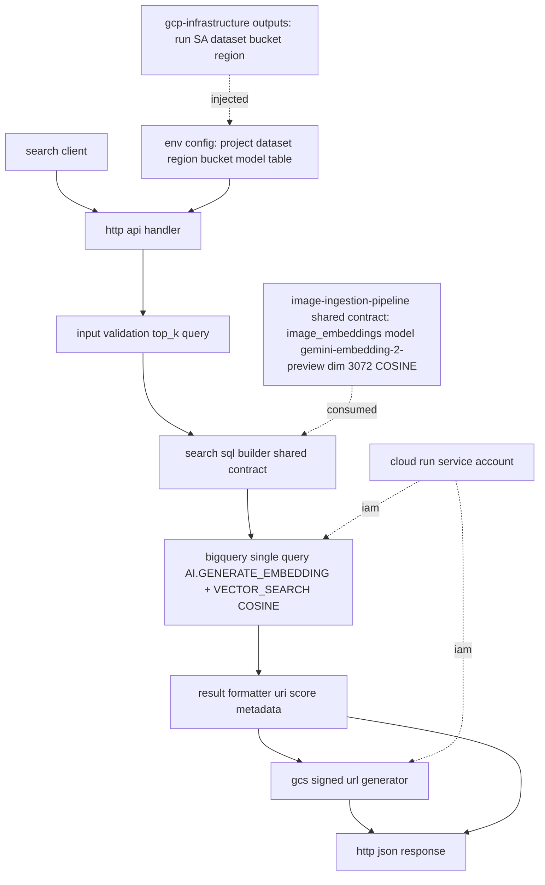
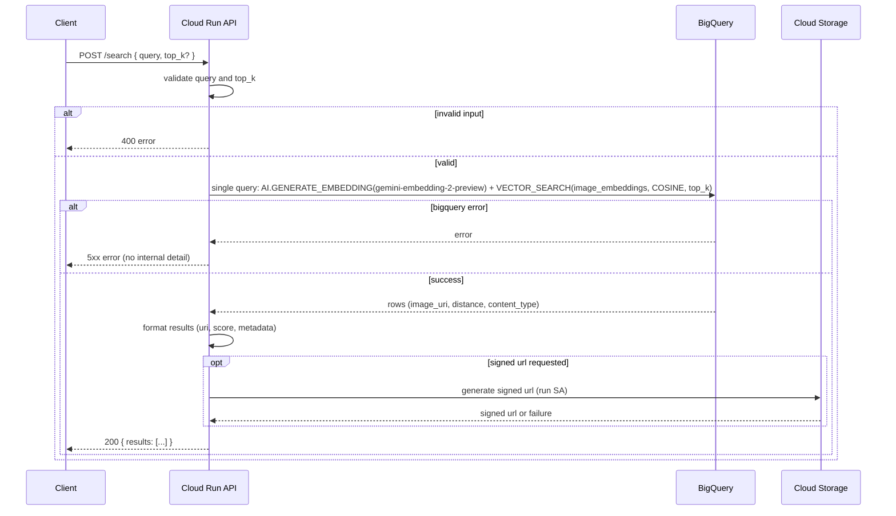

# Design Document

## Overview

`image-search-api` は、Cloud Run 上で稼働するステートレスなテキスト→画像検索 HTTP API である。リクエストごとに、クエリテキストの埋め込み生成と `VECTOR_SEARCH` を **同一の BigQuery クエリ** で実行し、一致画像の URI・スコア・（要求時の）GCS 署名付き URL を整形して返す。埋め込みモデル・次元・距離タイプ・テーブルスキーマは上流 `image-ingestion-pipeline` の共有契約をそのまま消費し、基盤リソース（Cloud Run 実行 SA・IAM・dataset・バケット）は `gcp-infrastructure` の出力を消費する。

本設計は、アプリケーションコード（API ハンドラ・BigQuery クライアント・検索クエリ組立て・結果整形・署名 URL 生成）と、Cloud Run デプロイ／ランタイム構成の 2 系統を定義する。常駐状態を持たず、環境依存値はすべて環境変数で注入する。

### Goals

- テキストクエリから意味的に一致する画像を返す HTTP API を提供する。
- クエリ埋め込み + `VECTOR_SEARCH` を単一 BigQuery クエリで実行し往復を削減する。
- 取込と同一ベクトル空間（モデル・次元・距離タイプ）で検索を成立させる。
- 上流出力・共有契約をパラメータ注入で消費し、ハードコードを排除する。

### Non-Goals

- 埋め込みの事前生成・テーブル/インデックス作成（`image-ingestion-pipeline` 所有）。
- GCS バケット・dataset・実行 SA・IAM の作成（`gcp-infrastructure` 所有）。
- 認証・認可・レート制限・フロント UI（明示要求まで対象外）。
- モデル名・次元・距離タイプの再定義（上流が source of truth）。

## Boundary Commitments

本仕様の責任境界を具体的に固定する。アーキテクチャ・タスク・後続検証の基準とする。

### This Spec Owns

- `src/` 配下の Cloud Run アプリケーションコード:
  - HTTP API ハンドラ（リクエスト/レスポンス契約、入力バリデーション）。
  - BigQuery クライアント呼び出しと検索 SQL の組立て（クエリ埋め込み + `VECTOR_SEARCH` を同一クエリで実行）。
  - 結果整形（画像 URI・類似度スコア・任意メタデータ）。
  - GCS 署名付き URL 生成。
  - 設定読み込み（環境変数からのパラメータ注入）とエラー処理。
- 検索クエリで用いる SQL テンプレート（共有契約のテーブル/列/モデル/距離タイプを参照するパラメータ化クエリ）。
- Cloud Run デプロイ／ランタイム構成（コンテナ定義、サービス設定、環境変数、実行 SA 割当、ビルド・デプロイ・ローカル検証手順）。
- HTTP リクエスト/レスポンスおよびエラーレスポンスの JSON スキーマ（安定契約）。

### Out of Boundary

- `image_embeddings` テーブル・VECTOR INDEX・リモートモデルの作成（`image-ingestion-pipeline` 所有）。
- GCS バケット・BigQuery dataset・Cloud Run 実行用サービスアカウント・IAM ロールバインドのプロビジョニング（`gcp-infrastructure` 所有）。
- モデル名・埋め込み次元・距離タイプ・テーブル名/列名の定義（上流 source of truth を消費するのみ）。
- 認証/認可/レート制限、フロント UI。

### Allowed Dependencies

- 上流 `gcp-infrastructure` の出力: GCS 画像バケット名、BigQuery dataset（project 修飾識別子）、Cloud Run 実行用サービスアカウントのメール、単一 `region`。`terraform output` 由来の値を環境変数として注入する。
- 上流 `image-ingestion-pipeline` の共有契約: テーブル `image_embeddings`、列 `image_uri` / `embedding`(dim=3072) / `content_type` / `generated_at`、リモートモデルのオブジェクト名 `gemini_embedding_model`（エンドポイント `gemini-embedding-2-preview`）、距離タイプ `COSINE`。`${MODEL}` に注入する値は取込が作成したモデルオブジェクト名 `gemini_embedding_model` であり、検索 SQL の `MODEL` 参照が取込側と同一オブジェクトに解決される。
- BigQuery（GoogleSQL、`AI.GENERATE_EMBEDDING` + `VECTOR_SEARCH`）、Vertex AI（リモートモデル経由）、Cloud Storage（署名 URL）。
- 制約: これらの識別子・契約値は再定義せず、パラメータ注入で消費する。ハードコード禁止。

### Revalidation Triggers

- 共有契約（テーブル名 `image_embeddings`、列名、`embedding` 次元 3072、モデル名 `gemini-embedding-2-preview`、距離タイプ `COSINE`）のいずれかが上流で変更された場合。
- **上流 Revalidation 起票（image-ingestion-pipeline Task 0, 2026-06-19）**: エンドポイント名が `gemini-embedding-2`→`gemini-embedding-2-preview` に修正された（実在しない名称の是正）。本仕様は `${MODEL}` にモデル**オブジェクト名** `gemini_embedding_model` を注入するため**機能的契約は不変**で、検索クエリ実装の変更は不要。ドキュメント上のエンドポイント名のみ整合済み。次元 3072・距離タイプ COSINE も不変。`gemini-embedding-2-preview` は **Preview ステージ**である点に留意（提供形態変更時は本トリガー対象）。
- `gcp-infrastructure` の出力名・出力構造（バケット名・dataset・実行 SA メール・region）が変更された場合。
- Cloud Run 実行 SA に付与される IAM ロール集合が変更され、署名 URL / BigQuery / Vertex 利用権限に影響する場合。
- HTTP リクエスト/レスポンス契約（フィールド名・型・エラー構造）を変更する場合（下流クライアントへ影響）。

## Architecture

### Architecture Pattern & Boundary Map

ステートレスなリクエスト/レスポンス型 Web サービス。依存方向は「HTTP リクエスト → 入力バリデーション → 検索クエリ組立て → BigQuery 実行（クエリ埋め込み + `VECTOR_SEARCH` 同一クエリ）→ 結果整形（+ 署名 URL）→ HTTP レスポンス」。設定は起動時に環境変数から読み込み、各層へ注入する。



**Architecture Integration**:
- Selected pattern: 単一責務の HTTP サービス + 層分離（ハンドラ / クエリ組立て / 整形 / 署名 / 設定）。KISS/YAGNI、ステートレス、テスト容易。
- Domain/feature boundaries: API・検索クエリ・結果整形・署名 URL・設定・デプロイ構成をモジュール単位で分離。
- New components rationale: 各モジュールは brief の Boundary Candidates（HTTP API レイヤ / クエリ埋め込み+VECTOR_SEARCH / 結果整形・署名 URL / Cloud Run 構成）に 1:1 対応。
- Steering compliance: roadmap の「Cloud Run から `AI.GENERATE_EMBEDDING` + `VECTOR_SEARCH` を同一クエリで実行」「同一モデルで同一ベクトル空間」「最小権限 SA」を遵守。

### Technology Stack

| Layer | Choice / Version | Role in Feature | Notes |
|-------|------------------|-----------------|-------|
| ランタイム | Cloud Run（コンテナ、ステートレス）| HTTP サービス実行基盤 | 上流払い出しの実行 SA を割当 |
| 検索エンジン | BigQuery (GoogleSQL) | クエリ埋め込み + ベクトル探索の実行 | `AI.GENERATE_EMBEDDING` + `VECTOR_SEARCH` を同一クエリ |
| 埋め込みモデル | リモートモデル → `gemini-embedding-2-preview` | クエリテキスト→ベクトル生成 | 取込と同一、次元 3072 |
| ベクトル探索 | BigQuery VECTOR INDEX（COSINE）| 近似最近傍探索 | 取込時インデックスと同一距離タイプ |
| 画像配信 | Cloud Storage 署名付き URL | 一致画像への一時アクセス | 実行 SA の署名権限を利用 |
| 設定 | 環境変数注入 | 環境依存値の外部化 | 上流 `terraform output` から供給 |

> 実装言語・HTTP フレームワーク・BigQuery クライアントライブラリの具体バージョンは実装タスクで確定する。`AI.GENERATE_EMBEDDING`（GoogleSQL の AI 関数）でクエリ埋め込みを生成し、`VECTOR_SEARCH` と同一クエリで結合する方針は本設計で固定する。

## File Structure Plan

### Directory Structure

```
src/
├── server.{ext}            # HTTP サーバ起動・ルーティング・ポート/ヘルスチェック
├── handler.{ext}           # 検索エンドポイントのハンドラ（リクエスト解析・レスポンス整形・エラーマッピング）
├── validation.{ext}        # 入力バリデーション（query 必須・top_k 範囲）
├── search_query.{ext}      # 検索 SQL 組立て（AI.GENERATE_EMBEDDING + VECTOR_SEARCH、共有契約パラメータ参照）
├── bigquery_client.{ext}   # BigQuery ジョブ実行ラッパ（パラメータ化クエリ、タイムアウト/エラー変換）
├── result_formatter.{ext}  # 一致行→レスポンス項目（uri / score / metadata）整形、スコア表現の一貫化
├── signed_url.{ext}        # GCS 署名付き URL 生成（実行 SA 権限、有効期限）
└── config.{ext}            # 環境変数からの設定読込（project/region/dataset/table/model/bucket）とバリデーション
sql/
└── search.sql              # クエリ埋め込み + VECTOR_SEARCH の同一クエリテンプレート（プレースホルダ外部化）
deploy/
├── Dockerfile              # コンテナビルド定義
├── service.yaml            # Cloud Run サービス定義（実行 SA 割当・環境変数・リソース設定）
└── .env.example            # 必須環境変数の入力例（project_id, region, dataset_id, table, model, bucket）
docs/
└── runbook.md              # ビルド・デプロイ・必須環境変数・ローカル起動/検証手順
tests/
└── ...                     # ハンドラ/バリデーション/クエリ組立て/整形のテスト
```

> 環境依存値はすべて `config.{ext}` 経由で環境変数から注入し、`search.sql` および各モジュールはプレースホルダ（例: `@query`, `${DATASET_ID}`, `${TABLE}`, `${MODEL}`）を介して参照する。`handler.{ext}` が検証→クエリ組立て→BigQuery 実行→整形→署名 URL の統合点。`{ext}` は実装言語に応じて確定する。

### Modified Files

- なし（グリーンフィールド。全ファイル新規作成）。

## System Flows

検索リクエスト 1 回の処理フロー:



クエリ埋め込み生成と `VECTOR_SEARCH` は単一 BigQuery クエリで実行し、BigQuery への往復を 1 回に抑える。署名 URL 生成は要求時のみ実行し、個別失敗は他結果の返却を妨げない。

## Requirements Traceability

| Requirement | Summary | Components | Files | Flow |
|-------------|---------|------------|-------|------|
| 1.1-1.5 | 検索エンドポイントとリクエスト/レスポンス契約 | ApiHandler, ResultFormatter | handler, validation, result_formatter | search seq |
| 2.1-2.6 | クエリ埋め込み + VECTOR_SEARCH 同一クエリ・共有契約整合 | SearchQueryBuilder, BigQueryClient, Config | search_query, bigquery_client, config, sql/search.sql | search seq |
| 3.1-3.5 | 結果整形（URI / 署名 URL / スコア / メタデータ） | ResultFormatter, SignedUrlGenerator | result_formatter, signed_url | search seq |
| 4.1-4.6 | エラー処理と境界条件 | ApiHandler, InputValidation, BigQueryClient | handler, validation, bigquery_client | search seq |
| 5.1-5.6 | Cloud Run デプロイ・ランタイム・パラメータ注入・最小権限 | DeployConfig, Config | deploy/Dockerfile, deploy/service.yaml, deploy/.env.example, config, docs/runbook.md | deploy |

## Components and Interfaces

### API / Application

#### ApiHandler

| Field | Detail |
|-------|--------|
| Intent | 検索エンドポイントの入出力契約とエラーマッピングを担う統合点 |
| Requirements | 1.1, 1.2, 1.3, 1.4, 1.5, 4.1, 4.4, 4.6 |

**Responsibilities & Constraints**
- リクエスト JSON（`query` 必須、`top_k` 任意、署名 URL 要否フラグ）を解析する。
- 検証→クエリ組立て→BigQuery 実行→整形→署名 URL を順に呼び出し、200 / 4xx / 5xx を返す。
- レスポンス/エラー JSON スキーマ（フィールド名・型）を安定契約として固定する。
- 内部例外詳細をクライアントへ漏洩しない。

**Dependencies**
- Inbound: HTTP クライアント（P0）
- Outbound: InputValidation, SearchQueryBuilder, BigQueryClient, ResultFormatter, SignedUrlGenerator, Config（P0）

**Contracts**: API [x]

##### API Contract
- Request: `{ "query": STRING, "top_k": INT(任意), "signed_url": BOOL(任意) }`
- Response (200): `{ "results": [ { "image_uri": STRING, "score": FLOAT, "signed_url": STRING(任意), "content_type": STRING(任意) } ] }`
- Error: `{ "error": { "code": STRING, "message": STRING } }`（4xx/5xx 共通構造）

**Implementation Notes**
- Integration: `handler.{ext}` が全層の統合点。
- Validation: 受入基準 1.x/4.x をハンドラ単体テストで検証可能。

#### InputValidation

| Field | Detail |
|-------|--------|
| Intent | 不正入力を BigQuery 実行前に弾く |
| Requirements | 4.1, 4.2 |

**Responsibilities & Constraints**
- `query` が非空であることを保証。空/欠如時は 400、BigQuery を呼ばない。
- `top_k` が許容範囲内であることを保証。範囲外は 400 もしくは安全範囲へ丸め（方針を一貫適用）。

**Dependencies**
- Inbound: ApiHandler（P0）

**Contracts**: State [ ] / API [x]

**Implementation Notes**
- Validation: 境界値（空クエリ・top_k=0/負/上限超過）のテストを用意。

### Search / BigQuery

#### SearchQueryBuilder

| Field | Detail |
|-------|--------|
| Intent | 共有契約に従う検索 SQL を組み立てる |
| Requirements | 2.1, 2.2, 2.3, 2.4, 2.5, 2.6 |

**Responsibilities & Constraints**
- クエリ埋め込み生成（`AI.GENERATE_EMBEDDING`、リモートモデル `gemini-embedding-2-preview`）と `VECTOR_SEARCH`（対象 `image_embeddings.embedding`、`distance_type='COSINE'`、`top_k`）を **同一クエリ** に組み立てる。
- モデル名・テーブル名・列名・距離タイプ・dataset を設定（注入値）から参照し、コード内へ再定義・ハードコードしない。
- 次元（3072）は取込と同一モデルを用いることで暗黙整合し、不一致を生じさせない。

**Dependencies**
- Inbound: ApiHandler（P0）
- Inbound: Config — dataset/table/model（P0）
- Inbound: image-ingestion-pipeline 共有契約（P0、消費のみ）

**Contracts**: State [ ] / API [x]

##### Query Shape（GoogleSQL, パラメータ化）
- クエリ埋め込み: `AI.GENERATE_EMBEDDING(MODEL \`${PROJECT}.${DATASET}.${MODEL}\`, (SELECT @query AS content))` 相当でクエリベクトルを得る。
- 探索: `VECTOR_SEARCH(TABLE \`${PROJECT}.${DATASET}.image_embeddings\`, 'embedding', (クエリベクトル), top_k => @top_k, distance_type => 'COSINE')`。
- 出力: `base.image_uri`, `distance`, `base.content_type` を選択。
- 上記は単一クエリ（CTE/サブクエリ結合）として発行する。

**Implementation Notes**
- Integration: `sql/search.sql` をテンプレート化し、`bigquery_client.{ext}` がパラメータをバインドして実行。
- Validation: 注入された設定値（`${MODEL}`＝モデルオブジェクト名 `gemini_embedding_model`、`${TABLE}`＝`image_embeddings`、距離タイプ `COSINE`）からレンダリングされた SQL に対し、それらの注入値が反映されていることをテストで確認する（ソース中のハードコード文字列リテラルではなく、注入値由来のレンダリング結果を検証対象とする）。

#### BigQueryClient

| Field | Detail |
|-------|--------|
| Intent | BigQuery ジョブの実行とエラー変換 |
| Requirements | 2.3, 4.3 |

**Responsibilities & Constraints**
- パラメータ化クエリを単一ジョブとして実行し、行を返す。
- タイムアウト・クエリエラーを内部エラー型へ変換（クライアントへ詳細非漏洩）。
- 実行 SA の BigQuery 実行/読取・Vertex 利用権限のみを用いる。

**Dependencies**
- Inbound: ApiHandler / SearchQueryBuilder（P0）
- External: BigQuery, Vertex AI（リモートモデル経由）（P0）

**Contracts**: API [x]

**Implementation Notes**
- Validation: 失敗時に 5xx へマップされ詳細が漏れないことをテスト。

### Result / Storage

#### ResultFormatter

| Field | Detail |
|-------|--------|
| Intent | 一致行をレスポンス契約へ整形 |
| Requirements | 1.4, 3.1, 3.4, 3.5, 4.4 |

**Responsibilities & Constraints**
- 各行から `image_uri`・スコアを抽出し、スコア降順（最類似順）で並べる。
- `VECTOR_SEARCH` の距離出力を一貫したスコア表現へ整形し、意味（距離 or 類似度）を固定する。
- `content_type` 等のメタデータを任意フィールドとして付加可能にする。
- 0 件時は空配列を返す。

**Dependencies**
- Inbound: ApiHandler（P0）
- Outbound: SignedUrlGenerator（任意）（P0）

**Contracts**: API [x]

#### SignedUrlGenerator

| Field | Detail |
|-------|--------|
| Intent | 一致画像の GCS 署名付き URL を発行 |
| Requirements | 3.2, 3.3, 4.5 |

**Responsibilities & Constraints**
- 要求時のみ、対象バケットのオブジェクトに対し有効期限付き署名 URL を発行する。
- 実行 SA の署名権限を用い、対象バケット範囲に限定する。
- 個別の署名失敗は当該項目で URL 省略 or 障害明示にとどめ、他結果の返却を妨げない。

**Dependencies**
- Inbound: ResultFormatter / ApiHandler（P0）
- External: Cloud Storage（P0）
- Inbound: Config — bucket（P0）

**Contracts**: API [x]

### Runtime / Deploy

#### Config

| Field | Detail |
|-------|--------|
| Intent | 環境依存値の外部化と起動時バリデーション |
| Requirements | 2.5, 5.2, 5.3, 5.5 |

**Responsibilities & Constraints**
- `project_id`, `region`, `dataset_id`, `image_embeddings` テーブル名, モデル名 `gemini-embedding-2-preview`, 対象バケットを環境変数から読み込む。
- 必須値の欠如時は起動失敗（フェイルファスト）。コードへのハードコード禁止。

**Dependencies**
- Inbound: 全モジュール（P0）
- Inbound: gcp-infrastructure 出力 / image-ingestion-pipeline 共有契約（P0、注入）

**Contracts**: State [x]

#### DeployConfig

| Field | Detail |
|-------|--------|
| Intent | Cloud Run デプロイ／ランタイム構成 |
| Requirements | 5.1, 5.3, 5.4, 5.5, 5.6 |

**Responsibilities & Constraints**
- コンテナ（Dockerfile）と Cloud Run サービス定義（実行 SA 割当・環境変数・リソース・ポート）を提供。
- ステートレス運用。最小権限（既付与 IAM のみ利用）。region 整合。
- ビルド・デプロイ・必須環境変数・ローカル起動/検証手順を runbook に記載。

**Dependencies**
- Inbound: gcp-infrastructure 出力（実行 SA メール・dataset・バケット・region）（P0）

**Contracts**: State [x]

**Implementation Notes**
- Integration: `deploy/service.yaml` が実行 SA と環境変数を結線。
- Validation: 環境変数が `.env.example` に網羅され、ハードコードがないことを確認。

## Data Models

### Logical Data Model（消費する共有契約 / 再定義しない）

```
image_embeddings（image-ingestion-pipeline 所有, source of truth）
- image_uri      STRING            -- GCS URI（gs://...）
- embedding      ARRAY<FLOAT64>    -- 埋め込みベクトル、次元=3072、距離タイプ COSINE
- content_type   STRING            -- MIME タイプ（任意でレスポンスに付加）
- generated_at   TIMESTAMP         -- 埋め込み生成時刻（本 API は不使用または将来用）
索引: VECTOR INDEX(embedding) distance_type=COSINE（取込所有）
モデル: リモートモデル gemini-embedding-2-preview（取込所有、クエリ埋め込みで同一を使用）
```

参照整合性: 本 API はこのテーブル・インデックス・モデルを **読み取り/呼び出しのみ** で消費する。スキーマ・次元・距離タイプ・モデル名の所有者は `image-ingestion-pipeline`。

### API Data Contract（本仕様所有）

```
SearchRequest
- query        STRING   -- 必須、非空
- top_k        INT      -- 任意、未指定時は既定件数、範囲外は 400 or 丸め
- signed_url   BOOL     -- 任意、署名 URL 要否

SearchResult
- image_uri    STRING   -- gs:// URI
- score        FLOAT    -- 距離由来の一貫したスコア表現
- signed_url   STRING   -- 任意（要求かつ生成成功時）
- content_type STRING   -- 任意

SearchResponse  : { results: SearchResult[] }
ErrorResponse   : { error: { code STRING, message STRING } }
```

## Error Handling

### Error Strategy

入力起因は 4xx、上流/内部起因は 5xx に分類し、共通のエラー JSON 構造で返す。BigQuery 実行前に入力検証を完了させ、無効リクエストでクエリを発行しない。内部例外詳細はクライアントへ漏洩させない。

### Error Categories and Responses

| Category | Trigger | Response | Requirement |
|----------|---------|----------|-------------|
| 入力エラー | `query` 空/欠如 | 400 + error、クエリ未実行 | 4.1 |
| 入力エラー | `top_k` 範囲外 | 400 もしくは安全範囲へ丸め（一貫適用）| 4.2 |
| 上流/内部エラー | BigQuery 失敗・タイムアウト・埋め込み生成失敗 | 5xx + error（内部詳細非漏洩）| 4.3 |
| 正常・空結果 | 一致 0 件 | 200 + `{ results: [] }` | 4.4 |
| 部分失敗 | 署名 URL 生成失敗 | 当該項目で URL 省略/障害明示、他は返却 | 4.5 |

### Monitoring

- Cloud Run / BigQuery のログとメトリクスで、エラー率・レイテンシ・BigQuery ジョブ失敗を観測する（基盤標準のロギングに依存）。

## Testing Strategy

### 検証項目（受入基準由来）

- ApiHandler: 正常リクエストで 200 と結果配列、空クエリで 400（BigQuery 未実行）、内部失敗で 5xx かつ詳細非漏洩（1.1, 1.4, 4.1, 4.3）。
- レスポンス契約: 各結果に `image_uri`・`score`、要求時 `signed_url` が含まれ、スキーマが安定契約どおり（1.2, 1.5）。
- 既定 top_k: `top_k` 未指定で既定件数の結果が返る（1.3）。
- SearchQueryBuilder: 注入された設定値（`${MODEL}`＝モデルオブジェクト名 `gemini_embedding_model`・`${TABLE}`＝`image_embeddings`・距離タイプ `COSINE`）からレンダリングされた SQL に対し、それらの注入値が反映され、かつ埋め込みと `VECTOR_SEARCH` が単一クエリであることを検証する（ソース中のハードコード文字列リテラルではなく、注入値由来のレンダリング結果を検証対象とする）（2.1, 2.3, 2.4, 2.5）。
- 共有契約整合: モデル名・次元・距離タイプ・テーブル/列名が設定注入由来で、コードにハードコードがない（2.2, 2.5, 2.6）。
- ResultFormatter: スコア降順整列・スコア表現の一貫性・0 件で空配列（1.4, 3.1, 3.4, 4.4）、`content_type` 付加（3.5）。
- SignedUrlGenerator: 要求時に有効期限付き URL を対象バケット範囲で生成、生成失敗が他結果返却を妨げない（3.2, 3.3, 4.5）。
- InputValidation: `top_k` 境界値の扱いが一貫（4.2）。
- Config / DeployConfig: 必須環境変数欠如で起動失敗、`.env.example` に必須値網羅、実行 SA 割当・region 整合・最小権限利用（5.1-5.6）。
- ローカル検証: runbook 手順でローカル起動し、検索が動作することを確認（5.6）。

## Security Considerations

- 最小権限: 実行 SA は BigQuery 実行/読取・Vertex 利用・GCS 署名/読取のみを利用し、過剰権限を要求しない（5.4）。
- 情報漏洩防止: 内部例外詳細・SQL・スタックトレースをクライアントへ返さない（4.3）。
- 署名 URL: 有効期限を限定し、対象バケットのオブジェクトに限定して発行する（3.2, 3.3）。
- 設定: 機密・環境依存値は環境変数注入とし、コード/イメージへ埋め込まない（5.2）。

## Performance & Scalability

- 往復削減: クエリ埋め込みと `VECTOR_SEARCH` を単一 BigQuery クエリで実行しレイテンシを抑える（2.3）。
- ステートレス: Cloud Run の水平スケールに適合し、リクエスト間状態を持たない（5.3）。
- 署名 URL は要求時のみ生成し、不要時の処理コストを避ける（3.2）。
